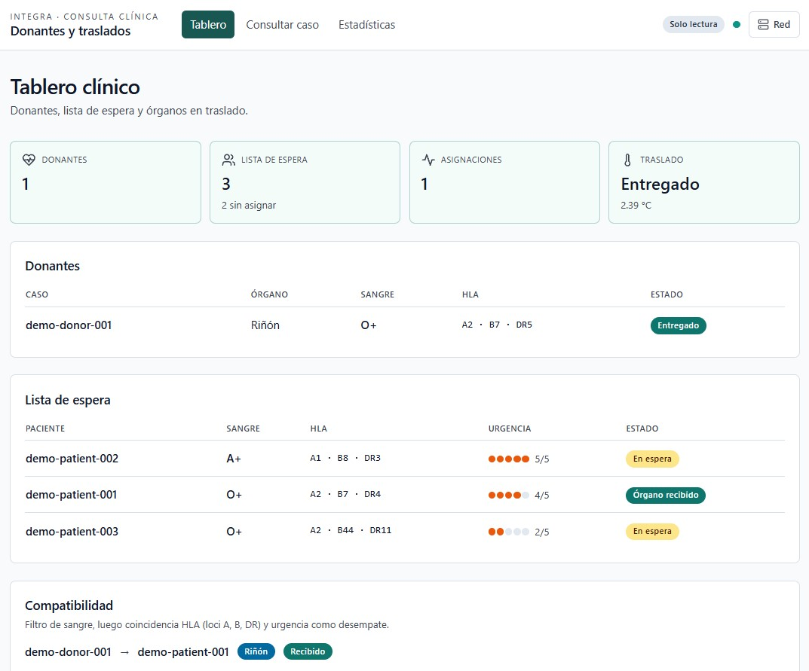
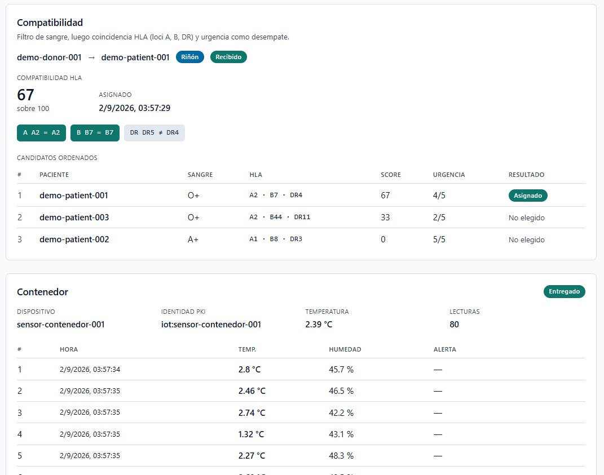
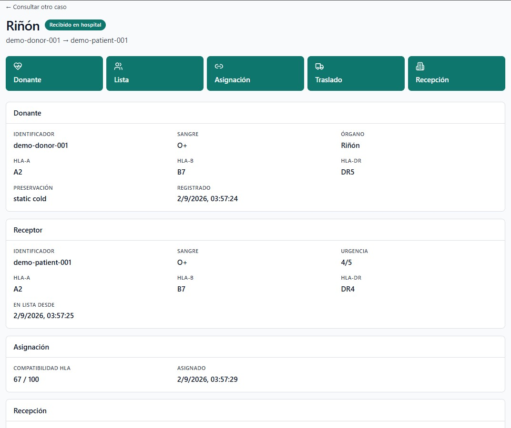
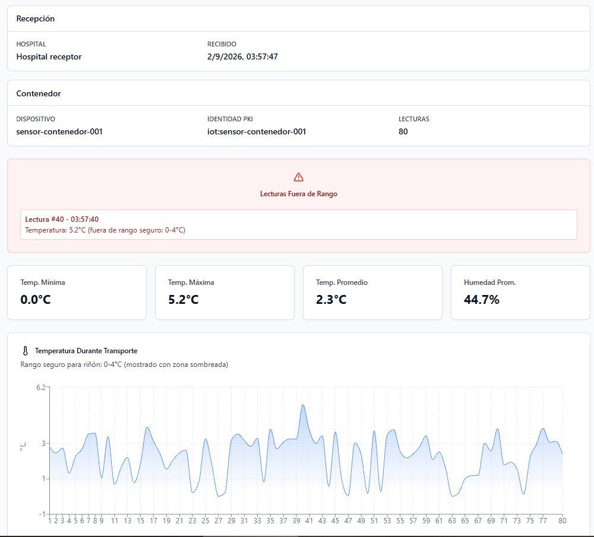
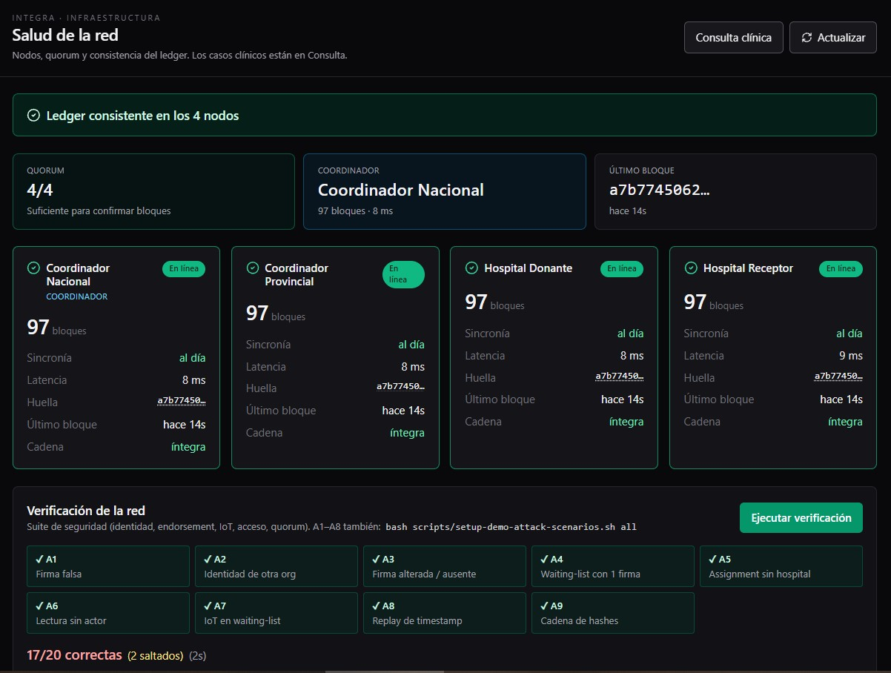
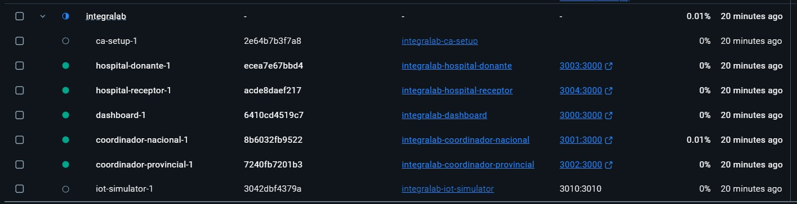

# INTEGRAlab

Infraestructura de Trazabilidad e Identidad para la Gestión de Recursos de Asignación.

Prototipo: ledger hash-encadenado + PKI X.509 + telemetría IoT + compatibilidad HLA.
**4 nodos, 20 tests de seguridad, dashboard de consulta clínica y de infraestructura.**

## ❤️ [Mira nuestro video](https://video-wciso-integra.vercel.app/)

### 🔗 [Mira nuestra presentación](https://comforting-cranachan-f05a65.netlify.app/)

## Equipo

| Nombre | País | Perfil | Contacto |
|--------|------|--------|----------|
| **María José Rabellino** | Argentina | Ingeniera en Sistemas · Máster en Ingeniería Blockchain | [majorabellino@gmail.com](mailto:majorabellino@gmail.com) |
| **Silvia Hernández Márquez** | México | Ingeniera en Software y Redes | [silvia03hm@gmail.com](mailto:silvia03hm@gmail.com) |
| **Angely Samira Segovia Chávez** | Ecuador | Estudiante avanzada de Ingeniería en Software | [angesegoviachavez@gmail.com](mailto:angesegoviachavez@gmail.com) |


---

## Quick start

```bash
./scripts/reset.sh --force
docker compose up --build -d
curl -s http://localhost:3001/health | jq '.ledgerHeight'
bash scripts/setup-demo-pitch-data.sh
```

| Qué | Dónde |
| --- | --- |
| Consulta clínica | http://localhost:3000/dashboard |
| Salud de la red | http://localhost:3000/infra |

Paso a paso: [PASOS_DETALLADOS.md](./PASOS_DETALLADOS.md)

---

## Recorrido visual

Consulta clínica (`/dashboard`) y salud de la red (`/infra`). Caso de demo: `demo-donor-001` → `demo-patient-001`.

<table>
  <tr>
    <td align="center" valign="top" width="50%">
      <a href="./pantallas/panel_dashboard1.jpg">
        
      </a><br>
      <sub><b>Tablero</b> — donantes, lista de espera y estado del traslado</sub>
    </td>
    <td align="center" valign="top" width="50%">
      <a href="./pantallas/panel_dashboard2.jpg">
        
      </a><br>
      <sub><b>Compatibilidad</b> — ranking HLA y lecturas del contenedor</sub>
    </td>
  </tr>
  <tr>
    <td align="center" valign="top" width="50%">
      <a href="./pantallas/trazabilidad1.jpg">
        
      </a><br>
      <sub><b>Ficha</b> — donante → lista → asignación → traslado → recepción</sub>
    </td>
    <td align="center" valign="top" width="50%">
      <a href="./pantallas/trazabilidad2.jpg">
        
      </a><br>
      <sub><b>Telemetría</b> — 80 lecturas, rango 0–4 °C y alerta a mitad de viaje</sub>
    </td>
  </tr>
  <tr>
    <td align="center" valign="top" width="50%">
      <a href="./pantallas/panel_infra.jpg">
        
      </a><br>
      <sub><b>Infraestructura</b> — 4 nodos, quorum, integridad y verificación A1–A9</sub>
    </td>
    <td align="center" valign="top" width="50%">
      <a href="./pantallas/contenedores_docker.jpg">
        
      </a><br>
      <sub><b>Docker</b> — 4 nodos + dashboard en marcha; CA e IoT detenidos (profile iot)</sub>
    </td>
  </tr>
</table>

---

## Documentación

| Quiero… | Documento |
| --- | --- |
| Ver cómo funciona | [PASOS_DETALLADOS.md](./PASOS_DETALLADOS.md) |
| Probar ataques (A1–A9) | [PASOS_DE_ATAQUES.md](./PASOS_DE_ATAQUES.md) |
| Botón «Ejecutar verificación» | [DIAGNOSTICO_TESTS.md](./DIAGNOSTICO_TESTS.md) |
| Qué se simplificó vs producción | [docs/DECISIONES_DE_ALCANCE.md](./docs/DECISIONES_DE_ALCANCE.md) |

PDFs en `docs/fundamentacion/`: [historia de usuario](./docs/fundamentacion/INTEGRA_Historia_Usuario.pdf), [STRIDE](./docs/fundamentacion/INTEGRA_Paso1_Amenazas.pdf), [arquitectura](./docs/fundamentacion/INTEGRA_Paso2_Arquitectura.pdf), [implementación](./docs/fundamentacion/INTEGRA_Paso3_Implementacion.pdf), [glosario](./docs/fundamentacion/INTEGRA_Glosario.pdf).

---

## Simular ataques

Los escenarios A1–A8 **no escriben bloques**. A9 es tamper manual de `ledger.json` (al final).

```bash
bash scripts/setup-demo-attack-scenarios.sh a1    # cert autofirmado
bash scripts/setup-demo-attack-scenarios.sh a3    # firma modificada
bash scripts/setup-demo-attack-scenarios.sh a4    # endorsement incompleto
bash scripts/setup-demo-attack-scenarios.sh all   # A1–A8
```

Esperado: rechazados (altura del ledger = 0 si el ledger estaba vacío). Detalle: [PASOS_DE_ATAQUES.md](./PASOS_DE_ATAQUES.md).

No uses **Ejecutar verificación** a mitad de la demo clínica: esa suite **sí escribe** casos de test.

---

## Tests de seguridad

**En el navegador:** http://localhost:3000/infra → **Ejecutar verificación** (algunos tests se saltan dentro del contenedor del dashboard).

**En el host:**

```bash
npm run test:seguridad
```

Esperado: 20/20 (incluye tests que manipulan contenedores). [DIAGNOSTICO_TESTS.md](./DIAGNOSTICO_TESTS.md)

---

## Arquitectura

```
WEB DASHBOARD (http://localhost:3000)
    /dashboard  consulta clínica (solo lectura)
    /infra      salud de la red
         ↓ HTTP + identidad PKI
NODOS (3001–3004)
    Coordinador nacional + provincial + hospital donante + hospital receptor
    Hash-chain, PKI X.509, endorsement N-of-M, ledger JSON en ./data/
         ↓
IoT (profile iot) — lecturas firmadas tras un assignment
```

| Componente | Dónde | Qué hace |
| --- | --- | --- |
| Backend | `nodes/` | Ledger, validación, PKI, endorsement |
| Dashboard | `dashboard/` | Consulta clínica + infra |
| IoT | `iot-simulator/` | Temperatura/humedad del contenedor |
| CA | `ca/` | Certificados X.509 |
| Tests | `tests/` | 20 tests STRIDE |

**Transacciones:** `donor-registry` → `waiting-list` → `assignment` → `custody` (telemetría) → `reception`.

---

## Configuración

```bash
# Primera vez (regenera certs)
./scripts/reset.sh --force --with-certs
docker compose up --build -d

# Entre sesiones (mantiene certs)
./scripts/reset.sh --force
docker compose up --build -d
```

Certificados: TTL 72 h. Si pasaron 3+ días, `--with-certs`.

```bash
curl -s http://localhost:3001/health | jq
curl -s http://localhost:3001/verify-integrity | jq
docker compose ps
```

---

## Qué queda cubierto

- Hash-chain, réplica entre 4 nodos, verificación de integridad
- X.509 por organización, firma RSA-2048, control de acceso por rol
- Endorsement N-of-M, matching de sangre + HLA, ranking de candidatos
- Cadena de frío IoT (cadencia 5 s, 80 lecturas en la demo) con alerta fuera de 0–4 °C
- 20/20 tests STRIDE (spoofing, tampering, replay, elevación de privilegio)

```
INTEGRAlab/
├── nodes/  dashboard/  iot-simulator/  ca/  tests/  scripts/
├── docs/fundamentacion/     # PDFs académicos
├── docs/DECISIONES_DE_ALCANCE.md
├── pantallas/                 # capturas de este README
├── PASOS_DETALLADOS.md
├── PASOS_DE_ATAQUES.md
├── DIAGNOSTICO_TESTS.md
└── README.md
```

**Stack:** Node.js 18 + Express + node-forge · Next.js 14 + Tailwind + Recharts · Docker Compose

---

Proyecto de investigación académica. Ver LICENSE.

**Actualizado:** 2 de septiembre 2026 · Tests: 20/20
