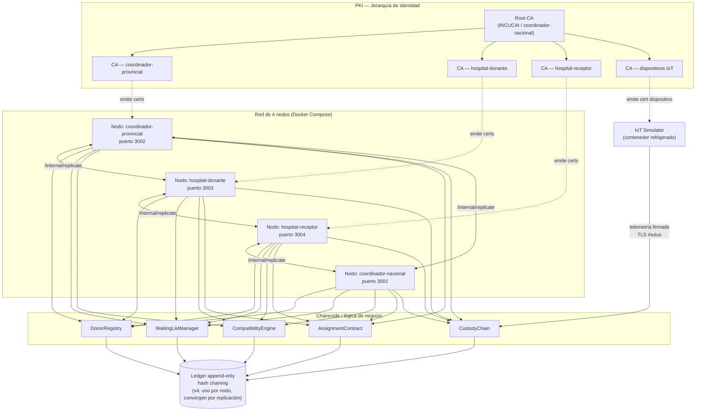

# Plan — README Técnico + Diagrama de Arquitectura

Spec para pasarle a Claude Code una vez que la suite de tests esté lista (o en paralelo, si preferís que arranque esto mientras el otro chat termina). Cubre el `README.md` de la raíz del repo y el diagrama de arquitectura que va embebido en él.

Por qué importa esto puntualmente para la entrega: la guía oficial pide explícitamente un "README breve explicando: objetivo, herramientas usadas y resultado obtenido", y el criterio de evaluación 5 ("Progreso del producto") pide mostrar prototipo/avance y próximos pasos. El README es lo primero que va a abrir cualquiera que entre al repo — jurado, mentores, o alguien de INCUCAI si esto avanza — así que tiene que poder leerse en 2 minutos y sostener una mirada técnica más profunda si alguien sigue leyendo.

---

## 1. Objetivo del README

Dos audiencias distintas leen el mismo archivo:

1. **El jurado / evaluador que entra por 2 minutos** — necesita entender qué es INTEGRA, qué problema resuelve, qué tan real es (no es solo una idea, hay código corriendo) y qué falta.
2. **Alguien técnico que quiere correrlo o auditarlo** — necesita instrucciones exactas para levantar el stack y entender las decisiones de arquitectura sin tener que leer los 3 documentos completos de Paso 1/2/3.

El README no reemplaza los documentos de Paso 1/2/3 — los referencia. No hace falta duplicar el análisis STRIDE completo ni la comparativa de plataformas ahí; eso vive en `docs/`.

---

## 2. Estructura propuesta del `README.md`

```markdown
# INTEGRA
### Infraestructura de Trazabilidad e Identidad para la Gestión de Recursos de Asignación

> Blockchain + Ciberseguridad + IoT aplicado a la cadena de suministro de donación de órganos.
> Piloto: Argentina (INCUCAI) · Modelo replicable para América Latina.

[1-2 líneas: qué problema resuelve, en una frase entendible sin contexto técnico previo]

## El problema en una línea
[Ej: "En Argentina y la región, la lista de espera de trasplantes es una base de datos modificable sin
registro inmutable de quién la cambia — y el caso UNOS en EE.UU. demuestra qué pasa cuando eso falla
incluso en el sistema más financiado del mundo."]

## Qué hace INTEGRA
- Registro inmutable del donante y la lista de espera (blockchain, hash chaining)
- Identidad criptográfica por actor (PKI X.509, jerarquía completa)
- Endorsement multi-organización para modificar datos críticos
- Cadena de custodia con IoT: telemetría firmada del traslado del órgano
- Detección de anomalías [si aplica al estado actual del código — si es futuro, marcarlo como roadmap]

## Estado actual del prototipo
[Tabla o lista corta: qué está validado end-to-end, con el link a los tests de seguridad como evidencia]

✅ PKI completa + generación de certificados
✅ Ledger con hash chaining + detección de tampering
✅ Replicación entre 4 nodos
✅ Políticas de endorsement (donor-registry, waiting-list, assignment, custody)
✅ IoT simulator con telemetría firmada + alertas
✅ CompatibilityEngine + AssignmentContract con prevención de replay
✅ Suite de 18 tests de seguridad automatizados — [X/18 PASS] (ver `tests/`)

## Arquitectura
[Diagrama acá — ver sección 3]

4 organizaciones en la red: `coordinador-nacional`, `coordinador-provincial`, `hospital-donante`,
`hospital-receptor` (nombres genéricos, no "INCUCAI", por diseño — ver `docs/DECISIONES_DE_ALCANCE.md`).

## Stack técnico
| Componente | Tecnología |
|---|---|
| Backend / nodos | Node.js + Express |
| Criptografía / PKI | node-forge, RSA-2048 |
| Ledger | Implementación propia con hash chaining (no Fabric real) |
| IoT | Simulador MQTT/TLS |
| Orquestación | Docker Compose (6 servicios) |
| Tests | Node + axios, sin frameworks pesados |

> Nota: las decisiones de alcance respecto a la arquitectura completa propuesta en `docs/INTEGRA_Paso2_Arquitectura.docx`
> (Hyperledger Fabric real, ECDSA P-256) están documentadas en `docs/DECISIONES_DE_ALCANCE.md`.

## Cómo correrlo

\`\`\`bash
docker compose up -d
npm run test:seguridad   # levanta el stack si no está corriendo, corre los 18 tests, lo deja andando
\`\`\`

[agregar acá los curl-examples.sh o el flujo manual si alguien quiere probarlo a mano]

## Documentación completa del proyecto
- [`docs/INTEGRA_Paso1_Amenazas.docx`](./docs/...) — Análisis de amenazas (STRIDE + MITRE ATT&CK)
- [`docs/INTEGRA_Paso2_Arquitectura.docx`](./docs/...) — Arquitectura técnica completa
- [`docs/INTEGRA_Paso3_Implementacion.docx`](./docs/...) — Hoja de ruta e implementación en Argentina/LATAM
- [`docs/INTEGRA_Historia_Usuario.docx`](./docs/...) — Caso de uso narrativo
- [`docs/DECISIONES_DE_ALCANCE.md`](./docs/...) — Qué se simplificó para el prototipo y por qué

## Próximos pasos
[lista corta — lo que quedó en el roadmap: kit de replicación regional, migración a Fabric real, etc.]

## Autora
María José Rabellino · Arquitecta de Solución · Ingeniera en Sistemas · Máster en Tecnología Blockchain
[email / contacto]

Proyecto presentado en el concurso WomenCISO4 / MenCISO1 (Fundación WomenCISO & MenCISO IAP).
```

---

## 3. Diagrama de arquitectura

Para que se vea directo en GitHub sin depender de una imagen externa, conviene usar **Mermaid** — GitHub lo renderiza nativo dentro del README, no hace falta exportar PNG ni mantener un archivo aparte sincronizado.

Diagrama propuesto (nivel de componentes, no de infraestructura de bajo nivel — para eso ya está el Paso 2 completo):



Este bloque Mermaid va directo dentro del README (GitHub lo renderiza solo). Claude Code debería:
1. Verificar que los nombres de los endpoints/puertos coincidan con la implementación real (`/internal/replicate`, 3001–3004) antes de pegarlo.
2. Ajustar los nombres de los chaincodes si difieren de los que terminaron implementados.
3. Si el diagrama queda muy denso, partirlo en dos: uno de PKI/identidad y otro de flujo de datos — mejor dos diagramas legibles que uno saturado.

---

## 4. Orden de trabajo

1. Confirmar contra el código real: puertos, nombres exactos de endpoints, chaincodes implementados vs. planeados (algunos módulos de Paso 2 como `PostOpRegistry` pueden no estar implementados — el README debe reflejar la realidad del código, no la arquitectura ideal completa).
2. Completar la sección "Estado actual del prototipo" con el resultado real de `npm run test:seguridad` (X/18) una vez que esa suite esté terminada — por eso este paso puede armarse ahora pero conviene cerrarlo después de la suite.
3. Escribir/ajustar `docs/DECISIONES_DE_ALCANCE.md` si todavía no está completo — el README lo referencia, así que tiene que existir y estar al día.
4. Insertar el diagrama Mermaid, validar que renderiza bien en GitHub (no todos los visores de Markdown soportan Mermaid — GitHub sí).
5. Recorrer el README como si fueras alguien del jurado leyéndolo por primera vez: ¿en 2 minutos entendés qué es, qué problema resuelve y que hay algo real corriendo?

## 5. Nota de secuencia

Este documento da por hecho que la sección "Estado actual del prototipo" se completa con el resultado real de la suite de 18 tests. Si querés, se puede armar el README ahora con placeholders (`[X/18 PASS]`) y completarlo en cuanto el otro chat termine, en vez de esperar — así no perdés tiempo en paralelo.


Los 18 tests pasan (18/18, ~20-25s). Antes de escribir el README, confirmá los nombres reales de endpoints (/sign, /tx, y los que uses para replicación entre nodos) contra el diagrama Mermaid que te pasé, y ajustá el diagrama si no coinciden. Completá "Estado actual del prototipo" con 18/18 PASS. Agregá en docs/DECISIONES_DE_ALCANCE.md una entrada explicando la ventana de 5 minutos para el nonce de replay en IoT (test12) y por qué es distinta a la ventana de 30 min de AssignmentContract. Después seguí con el resto de la spec del README tal cual está.