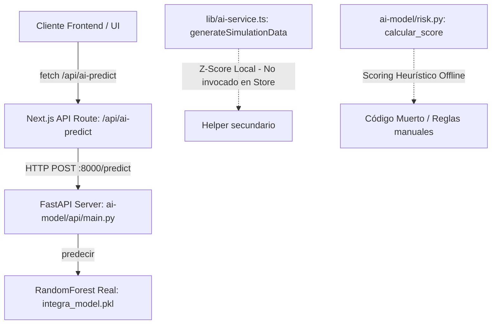
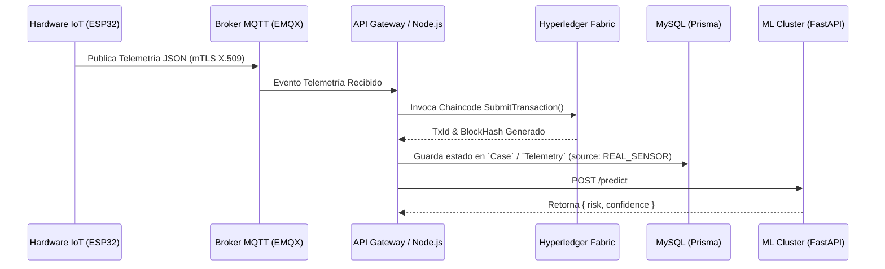

# Apéndice Técnico de Implementación: INTEGRA-MVP

> **Repositorio:** `gely25/INTEGRA-MVP`  
> **Rama:** `main`  
> **Propósito:** Documentación técnica de arquitectura, nivel de implementación código a código, análisis criptográfico, base de datos, microservicio de IA y mapa de extensibilidad hacia infraestructura real.

---

## 1. Stack Tecnológico y Librerías Exactas

En esta sección se detallan las librerías declaradas en las configuraciones de dependencias del frontend (`package.json`) y del microservicio de Inteligencia Artificial (`ai-model/requirements.txt`), indicando la versión exacta y su caso de uso específico dentro del proyecto **INTEGRA-MVP**.

### 1.1. Frontend (`package.json`)

**Ubicación del archivo:** [`package.json`](file:///c:/Users/Samira/Downloads/fixing-errors/package.json)

| Librería | Versión Exacta | Caso de Uso Específico en INTEGRA-MVP |
| :--- | :---: | :--- |
| `next` | `16.2.6` | Framework React full-stack. Provee el App Router, Server Components y las rutas de API (`app/api/ai-predict/route.ts`, `app/api/cases/route.ts`, `app/api/events/route.ts`). |
| `react` | `^19.0.0` | Librería central de interfaz de usuario para el renderizado por componentes. |
| `react-dom` | `^19.0.0` | Integración del árbol de componentes de React con el DOM del navegador. |
| `@base-ui/react` | `^1.5.0` | Primitivas de UI accesibles sin estilo base. Utilizado para construir el componente `<Select>` personalizado con grupos de tipos de eventos y severidades (`components/ui/select.tsx`) en el feed de trazabilidad. |
| `@prisma/client` | `^7.8.0` | Cliente ORM de base de datos. Se encuentra importado en `lib/db.ts` y en las API Routes `app/api/cases/route.ts` y `app/api/events/route.ts` para operaciones CRUD sobre la base MySQL definida en `prisma/schema.prisma`. |
| `recharts` | `3.8.0` | Visualización gráfica de series temporales de telemetría de temperatura (interna/externa) en tiempo real e histórica (`components/blocks/temperature-chart.tsx`, `components/blocks/forensic-panel.tsx`). |
| `lucide-react` | `^1.16.0` | Iconografía vectorial del sistema (escudos PKI, candados, termómetros, hashes, alertas de ransomware, estado de nodos). |
| `sonner` | `^2.0.7` | Sistema de notificaciones *toast* para retroalimentación de firmas criptográficas, alertas de isquemia y resolución de incidentes operacionales. |
| `class-variance-authority` | `^0.7.1` | Manejo y composición de variantes de estilos CSS dinámicos en componentes reutilizables UI. |
| `clsx` | `^2.1.1` | Utilidad para la concatenación condicional de clases CSS Tailwind. |
| `tailwind-merge` | `^3.3.1` | Combinación limpia de clases Tailwind en `lib/utils.ts`, evitando conflictos de especificidad. |
| `tw-animate-css` | `^1.4.0` | Animaciones CSS para diálogos modales (ej. firma de contrato, autorización criptográfica) y alertas en interfaz. |
| `next-themes` | `^0.4.6` | Proveedor para la alternancia y gestión de temas claro/oscuro en la interfaz de usuario. |
| `@vercel/analytics` | `1.6.1` | Captura de métricas de uso y telemetría de rendimiento en producción en la plataforma Vercel. |
| `prisma` *(dev)* | `^7.8.0` | CLI de Prisma para ejecutar migraciones (`prisma migrate`), introspección y generación del cliente TypeScript. |
| `tailwindcss` *(dev)* | `^4.2.0` | Framework de CSS utilitario v4 utilizado para todo el diseño visual del sistema. |
| `@tailwindcss/postcss` *(dev)*| `^4.2.0` | Plugin PostCSS para procesar la sintaxis de Tailwind CSS v4. |
| `typescript` *(dev)* | `5.7.3` | Verificación estática de tipos en todo el código base de Next.js y React. |

---

### 1.2. Backend de IA (`ai-model/requirements.txt`)

**Ubicación del archivo:** [`ai-model/requirements.txt`](file:///c:/Users/Samira/Downloads/fixing-errors/ai-model/requirements.txt)

| Librería | Versión Exacta | Caso de Uso Específico en INTEGRA-MVP |
| :--- | :---: | :--- |
| `fastapi` | `0.139.2` | Framework web para exponer la API REST de inferencia de riesgo (`POST /predict`) en `ai-model/api/main.py`. |
| `uvicorn` | `0.51.0` | Servidor ASGI HTTP de alto rendimiento utilizado para ejecutar el servicio FastAPI en `http://127.0.0.1:8000`. |
| `scikit-learn` | `1.9.0` | Entrenamiento y ejecución del modelo `RandomForestClassifier`, preprocesamiento con `LabelEncoder` y evaluación (`train.py`, `predict.py`). |
| `pandas` | `3.0.3` | Carga, manipulación y estructuración de los datasets sintéticos en formato DataFrame (`data/telemetria_entrenamiento.csv`) para entrenamiento y predicción. |
| `numpy` | `2.5.1` | Operaciones matemáticas matriciales y cálculo de probabilidades vectoriales en el modelo de Machine Learning. |
| `joblib` | `1.5.3` | Serialización y deserialización de artefactos compilados en disco: modelo (`integra_model.pkl`), codificadores (`label_encoders.pkl`) y columnas (`feature_columns.pkl`). |
| `pydantic` | `2.13.4` | Definición y validación estricta de esquemas de datos JSON de entrada (`PredictionRequest`) y salida (`PredictionResponse`) en `ai-model/api/schemas.py`. |
| `pydantic_core` | `2.46.4` | Motor subyacente en Rust para la validación acelerada de datos en Pydantic v2. |
| `starlette` | `1.3.1` | Toolkit web ASGI subyacente sobre el cual se construye FastAPI. |
| `matplotlib` | `3.11.1` | Generación de matrices de confusión y gráficos de rendimiento durante el entrenamiento local (`train.py`). |
| `scipy` | `1.18.0` | Operaciones numéricas avanzadas y soporte a scikit-learn en rutinas probabilísticas. |
| `anyio` | `4.14.2` | Librería de E/S asíncrona para la gestión de hilos y concurrencia en FastAPI/Starlette. |
| `click` | `8.4.2` | Interfaz de línea de comandos para la invocación del servidor Uvicorn desde la terminal. |
| `colorama` | `0.4.6` | Formateo con colores ANSI para los logs de la consola de Uvicorn en entornos Windows. |
| `h11` | `0.16.0` | Implementación pura en Python del protocolo HTTP/1.1 para Uvicorn. |
| `idna` | `3.18` | Validación y decodificación de nombres de dominio internacionalizados (IDNA). |
| `narwhals` | `2.24.0` | Capa ligera de compatibilidad entre DataFrames utilizada internamente por Pandas/Scikit-learn. |
| `packaging` | `26.2` | Análisis y verificación de compatibilidad de dependencias Python. |
| `pillow` | `12.3.0` | Procesamiento auxiliar de imágenes requeridas por Matplotlib. |
| `pyparsing` | `3.3.2` | Parsing de sintaxis para expresiones en gráficos y tipografía. |
| `python-dateutil` | `2.9.0.post0` | Formateo y manipulación de estampas de tiempo (`timestamp`) en las lecturas de telemetría. |
| `six` | `1.17.0` | Utilidades de compatibilidad de tipos Python. |
| `threadpoolctl` | `3.6.0` | Control de hilos en librerías nativas C/OpenMP usadas por scikit-learn. |
| `typing_extensions` | `4.16.0` | Extensiones de anotación de tipos para versiones de Python en Pydantic y FastAPI. |
| `tzdata` | `2026.3` | Base de datos de zonas horarias para manipulación de tiempo simulado. |

---

## 2. SHA-256 / Hashing — Detalle de Implementación

### 2.1. Funciones Exactas y Ubicación en Código

El cálculo del hash encadenado SHA-256 se encuentra implementado en dos niveles:

1. **Frontend (Simulación React Store):**
   - **Archivo:** [`lib/store.tsx`](file:///c:/Users/Samira/Downloads/fixing-errors/lib/store.tsx)
   - **Líneas exactas:** 40 – 50 (`genHash`) e invocación en líneas 183 – 215 (`addEventRaw`).

   ```typescript
   // lib/store.tsx (Líneas 40-50)
   async function genHash(prevHash: string, payload: string): Promise<string> {
     const data = new TextEncoder().encode(prevHash + payload)
     const digest = await crypto.subtle.digest("SHA-256", data)
     return (
       "0x" +
       Array.from(new Uint8Array(digest))
         .map((b) => b.toString(16).padStart(2, "0"))
         .join("")
         .slice(0, 12)
     )
   }
   ```

2. **Generador de Telemetría Python:**
   - **Archivo:** [`ai-model/simulator.py`](file:///c:/Users/Samira/Downloads/fixing-errors/ai-model/simulator.py)
   - **Líneas exactas:** 43 – 49 (`generar_hash`) y 401 – 427 (`generar_hash_evento`).

   ```python
   # ai-model/simulator.py (Líneas 401-427)
   def generar_hash_evento(case_id, evento, timestamp):
       texto = f"{case_id}{evento}{timestamp}{uuid.uuid4()}"
       return hashlib.sha256(texto.encode()).hexdigest()
   ```

---

### 2.2. API / Librería Criptográfica Real Utilizada

- **En el Frontend (`lib/store.tsx`):** Utiliza la **Web Crypto API nativa del navegador** a través del método estándar `crypto.subtle.digest("SHA-256", data)`. No utiliza librerías externas de Node (como `crypto` de Node.js) ni paquetes npm de terceros (como `crypto-js`).
- **En el Microservicio Python (`ai-model/simulator.py`):** Utiliza el módulo de la biblioteca estándar de Python `hashlib.sha256()`.

---

### 2.3. Estructura de Encadenado (Hash Chaining)

En [`lib/store.tsx`](file:///c:/Users/Samira/Downloads/fixing-errors/lib/store.tsx#L183-L215), el encadenado se construye mediante el siguiente flujo secuencial:

1. **Construcción del Payload:**  
   `payload = ${event}${time}${opts.actor}${opts.org}`
2. **Concatenación:**  
   Se concatenan en orden estricto el hash del evento inmediatamente anterior (`prevHash`) y el `payload` del nuevo evento:  
   `prevHash + payload`
3. **Cálculo de Digest:**  
   Se codifica la cadena a bytes UTF-8 con `TextEncoder` y se procesa con `crypto.subtle.digest("SHA-256", data)`.
4. **Estado Inicial (Génesis):**  
   Si la lista de eventos está vacía, el `prevHash` inicial es `"0x000000000000"`.

---

### 2.4. Truncamiento del Hash e Impacto de Seguridad

- **Detalle de Truncamiento en Frontend:**  
  En [`lib/store.tsx`](file:///c:/Users/Samira/Downloads/fixing-errors/lib/store.tsx#L48), la función `genHash` aplica un recorte explícito: `.slice(0, 12)`, agregando el prefijo `"0x"`. Esto resulta en una cadena hexadecimal de **12 caracteres** (ejemplo: `"0x4a9b2c3d1e0f"`).
- **¿Es solo visual o afecta el cálculo interno?**  
  **Afecta el cálculo interno del hash subsiguiente**. La función `genHash` retorna la cadena truncada de 12 caracteres y esta misma cadena truncada se almacena en el objeto `CustodyEvent.hash` de la lista de eventos. Cuando se registra el siguiente evento, se pasa dicho hash truncado como argumento `prevHash`. Por lo tanto, el hash del bloque $N+1$ se calcula efectivamente a partir de la versión truncada de 12 caracteres del bloque $N$.
- **Impacto Criptográfico:**  
  Un digest de SHA-256 completo consta de 256 bits (64 caracteres hexadecimales). Reducir el digest a 12 caracteres hexadecimales (48 bits de entropía) reduce drásticamente el espacio de búsqueda contra colisiones (ataque de cumpleaños a $2^{24}$ operaciones). En el contexto de **INTEGRA-MVP**, esta decisión responde a una simplificación de diseño para mantener la legibilidad visual en la interfaz de usuario durante las demostraciones. En una migración a producción con **Hyperledger Fabric**, el hash es calculado internamente por los nodos validadores (*Peers*) utilizando SHA-256/SHA3 completo de 256 bits dentro del Merkle Tree del bloque del libro mayor.

---

## 3. Base de Datos — MySQL + Prisma en Detalle

### 3.1. Modelos del `schema.prisma`

**Ubicación del archivo:** [`prisma/schema.prisma`](file:///c:/Users/Samira/Downloads/fixing-errors/prisma/schema.prisma)

```prisma
datasource db {
  provider = "mysql"
  url      = env("DATABASE_URL")
}

model Case {
  id                 String   @id @default(cuid())
  caseId             String   @unique
  organ              String
  origin             String
  originCity         String
  destination        String
  destinationCity    String
  currentLocation    String
  containerId        String
  deviceId           String
  status             String   // Preparado, Creado, En traslado, Recibido, Cerrado
  custodyStatus      String   // Pendiente, Activa, Recepción confirmada
  tempInternal       Float
  tempExternal       Float
  battery            Int
  gpsActive          Boolean
  connectivity       String
  source             String   // SIMULATED_SENSOR, REAL_SENSOR
  ischemiaWindowMin  Int
  ischemiaTargetMin  Int
  eta                String
  evidenceStatus     String   // VALID, BROKEN, pending
  deviceAuthorized   Boolean
  sealStatus         String
  coldChain          String
  routeProgress      Int

  events             Event[]
  telemetry          Telemetry[]
  alerts             Alert[]
  
  createdAt          DateTime @default(now())
  updatedAt          DateTime @updatedAt
}

model Event {
  id        String   @id @default(cuid())
  eventId   String   @unique
  eventName String   
  time      String
  actor     String
  org       String
  txId      String
  prevHash  String
  hash      String
  status    String   // VALID, BROKEN, pending

  caseId    String
  case      Case     @relation(fields: [caseId], references: [id])
}

model Telemetry {
  id        String   @id @default(cuid())
  time      String
  internal  Float
  external  Float

  caseId    String
  case      Case     @relation(fields: [caseId], references: [id])
}

model Alert {
  id           String   @id @default(cuid())
  alertId      String   @unique
  code         String   
  level        String   // info, warn, danger
  title        String
  detail       String
  time         String
  acknowledged Boolean  @default(false)

  caseId       String
  case         Case     @relation(fields: [caseId], references: [id])
}
```

---

### 3.2. Campos Preparados para Migración e Híbridos

Dentro del modelo `Case`, destacan los siguientes campos diseñados explícitamente para abstraer la infraestructura real:

1. **`Case.source`:** Acepta `"SIMULATED_SENSOR"` o `"REAL_SENSOR"`. Permite discriminar la procedencia de los paquetes de datos sin cambiar el pipeline de ingesta.
2. **`Case.custodyStatus`:** Pasa de `"Pendiente"` a `"Activa"` y `"Recepción confirmada"`, mapeando el ciclo de vida del Smart Contract en Hyperledger Fabric.
3. **`Case.evidenceStatus` y `Event.status`:** Aceptan `"VALID"`, `"BROKEN"` o `"pending"`, preparados para reflejar la verificación de sellos de manipulación física/digital.
4. **`Event.txId`:** Almacena identificadores con formato `tx_...`, preparados para alinearse con los hashes de transacción de Fabric (`TransactionID`).

---

### 3.3. Estado de Conexión del Frontend con la Base de Datos (Código Muerto)

> [!WARNING]  
> **EL SCHEMA DE PRISMA Y LA BASE DE DATOS MYSQL ESTÁN DESCONECTADOS EN TIEMPO DE EJECUCIÓN.**

#### Evidencia Técnica en Código:

1. **Desactivación explícita del cliente Prisma:**  
   En [`lib/db.ts`](file:///c:/Users/Samira/Downloads/fixing-errors/lib/db.ts):
   ```typescript
   // Fuera de alcance del MVP actual — el store corre en memoria (ver lib/store.tsx). Persistencia real pendiente de una siguiente iteración.
   // eslint-disable-next-line @typescript-eslint/no-explicit-any
   export const prisma: any = {}
   ```
2. **Endpoints de API aislados:**  
   En [`app/api/cases/route.ts`](file:///c:/Users/Samira/Downloads/fixing-errors/app/api/cases/route.ts) y [`app/api/events/route.ts`](file:///c:/Users/Samira/Downloads/fixing-errors/app/api/events/route.ts), existen funciones `GET` y `POST` con lógica RBAC y llamadas como `prisma.case.findFirst(...)` o `prisma.event.create(...)`. Sin embargo:
   - Ningún componente de la aplicación frontend realiza peticiones HTTP `fetch()` hacia `/api/cases` ni `/api/events`.
   - Si se llegaran a invocar estos endpoints, la aplicación arrojaría una excepción `TypeError: prisma.case.findFirst is not a function` debido a que `prisma` es un objeto vacío `{}`.
3. **Persistencia 100% en Memoria:**  
   Toda la aplicación opera mediante el estado global React encapsulado en [`lib/store.tsx`](file:///c:/Users/Samira/Downloads/fixing-errors/lib/store.tsx), utilizando hooks `useState`, `useRef` y constantes iniciales (`INITIAL_CASE`, `INITIAL_EVENTS`) importadas desde `lib/case-data.ts`.

---

## 4. Modelo de IA — Detalle de Entrenamiento e Inferencia

### 4.1. Algoritmo Exacto e Hiperparámetros de Entrenamiento

- **Ubicación:** [`ai-model/train.py`](file:///c:/Users/Samira/Downloads/fixing-errors/ai-model/train.py#L169-L181)
- **Algoritmo:** `RandomForestClassifier` (de `sklearn.ensemble`).
- **Hiperparámetros Exactos:**
  - `n_estimators`: `200` (número de árboles de decisión en el *ensemble*).
  - `random_state`: `42` (semilla de reproducibilidad).
  - `max_depth`: `12` (profundidad máxima de cada árbol).
  - `min_samples_split`: `5` (mínimo de muestras requeridas para dividir un nodo interno).
  - `min_samples_leaf`: `2` (mínimo de muestras requeridas en un nodo hoja).
  - **División de Datos:** `train_test_split(X, y, test_size=0.20, random_state=42, stratify=y)`.

---

### 4.2. Datos de Entrenamiento (Real vs. Sintético)

El modelo fue entrenado con **datos 100% sintéticos**.
- **Generador:** Script [`ai-model/simulator.py`](file:///c:/Users/Samira/Downloads/fixing-errors/ai-model/simulator.py).
- **Configuración de Generación:** Se generó el dataset `data/telemetria_entrenamiento.csv` definiendo en `config.py`: `NUM_CASOS = 100` y `LECTURAS_POR_CASO = 25` (total 2,500 registros de telemetría).
- **Reglas del Generador:** Inyecta fluctuaciones gaussianas de temperatura, desgastes aleatorios de batería y simula incidentes con una probabilidad `PROBABILIDAD_INCIDENTE = 0.08` (8%), tales como `COLD_CHAIN_BREAK`, `CONTAINER_OPENED`, `GPS_LOST`, `TRAFFIC_DELAY` y `BATTERY_LOW`.

---

### 4.3. Variables de Entrada y Orden Exacto

El modelo espera exactamente **16 variables de entrada** en el orden estricto definido en [`ai-model/train.py`](file:///c:/Users/Samira/Downloads/fixing-errors/ai-model/train.py#L60-L94) y serializado en `model/feature_columns.pkl`:

| Posición | Nombre de la Variable | Tipo de Dato | Valores / Rango Esperado |
| :---: | :--- | :---: | :--- |
| 1 | `organ` | String (Categorizado) | Codificado por `LabelEncoder`: `'Corazón'`, `'Hígado'`, `'Pulmón'`, `'Riñón'`. |
| 2 | `transport` | String (Categorizado) | Codificado por `LabelEncoder`: `'Ambulancia'`, `'Avión'`, `'Helicóptero'`. |
| 3 | `temp_internal` | Float | Temperatura interna del contenedor (°C). |
| 4 | `temp_external` | Float | Temperatura ambiental externa (°C). |
| 5 | `battery` | Int | Nivel de batería del sensor (0 – 100%). |
| 6 | `gps_active` | Int | `1` (Activo / Con señal), `0` (Sin señal). |
| 7 | `connectivity` | Int | `1` (Conectado / Online), `0` (Offline). |
| 8 | `ischemia_window` | Int | Tiempo restante de isquemia en **minutos**. |
| 9 | `route_progress` | Int | Porcentaje del recorrido completado (0 – 100%). |
| 10 | `cold_chain` | Int | `1` (Íntegra / Válida), `0` (Comprometida). |
| 11 | `evidence_status` | Int | `1` (Sello Intacto), `0` (Contenedor Abierto/Alterado). |
| 12 | `humidity` | Float | Humedad relativa (%). |
| 13 | `pressure` | Float | Presión atmosférica (hPa). |
| 14 | `signal` | Int | Intensidad de señal de red celular (0 – 100%). |
| 15 | `gps_accuracy` | Float | Precisión del GPS en metros. |
| 16 | `incident` | String (Categorizado) | Codificado por `LabelEncoder`: `'BATTERY_LOW'`, `'COLD_CHAIN_BREAK'`, `'CONTAINER_OPENED'`, `'GPS_LOST'`, `'NETWORK_FAILURE'`, `'NONE'`, `'ROUTE_DEVIATION'`, `'SENSOR_FAILURE'`, `'TRAFFIC_DELAY'`. |

- **Variable Objetivo (`target`):** `risk` $\rightarrow$ Clases: `'Low'`, `'Medium'`, `'High'`.

---

### 4.4. Desglose de Módulos de IA / Anomalías (Activos vs. Código Muerto)

En el repositorio conviven **3 implementaciones distintas** relacionadas con IA y análisis de anomalías. Es fundamental diferenciar cuál se ejecuta en el flujo activo:



#### 1. Modelo ML Real (RandomForest en FastAPI) — **[FLUJO ACTIVO]**
- **Archivos:** `ai-model/api/main.py`, `ai-model/predict.py`, `app/api/ai-predict/route.ts`, `lib/ai-service.ts` (`predictRisk`).
- **Funcionamiento:** En [`lib/store.tsx`](file:///c:/Users/Samira/Downloads/fixing-errors/lib/store.tsx#L488-L557), la función `fetchAiPrediction()` mapea el estado del cliente hacia las 16 variables del modelo y realiza un `fetch('/api/ai-predict')`, el cual redirige a la API Python en `http://127.0.0.1:8000/predict`. Retorna `risk` ("Low", "Medium", "High") y `confidence` (porcentaje 0-100%).
- **Comportamiento si no está encendido:** Si el servidor FastAPI no está corriendo, `app/api/ai-predict/route.ts` responde con HTTP status `503` y la UI captura el error mostrando el badge en estado neutro o sin predicción, permitiendo que el dashboard continúe funcionando sin interrupciones.

#### 2. Detección Estadísticas Z-Score (`generateSimulationData`) — **[CÓDIGO SECUNDARIO / ALTERNATIVO]**
- **Archivo:** [`lib/ai-service.ts`](file:///c:/Users/Samira/Downloads/fixing-errors/lib/ai-service.ts#L35-L72)
- **Funcionamiento:** Calcula la media y desviación estándar de las últimas 5 lecturas de temperatura. Evalúa la fórmula:
  $$Z = \frac{|T_{\text{interna}} - \mu|}{\sigma}$$
  Si $Z > 3.0$ o $T_{\text{interna}} \ge 7.5^\circ\text{C}$, marca `hasAnomaly = true`.
- **Estado:** Esta función es una utilidad expuesta en `lib/ai-service.ts`, pero **no está conectada al bucle del reloj de simulación principal (`useEffect`)** en `lib/store.tsx`. El store simula las anomalías leyendo directamente la constante `TIMELINE_EVENTS` de `lib/case-data.ts`.

#### 3. Clasificación Heurística por Puntos (`risk.py`) — **[CÓDIGO MUERTO / OFFLINE]**
- **Archivo:** [`ai-model/risk.py`](file:///c:/Users/Samira/Downloads/fixing-errors/ai-model/risk.py)
- **Funcionamiento:** Contiene una lógica de suma de puntos mediante condicionales `if/else` manuales (ej. `temp_internal > 8` asigna 40 puntos; `cold_chain == 0` asigna 35 puntos). Si el puntaje acumulado es $\ge 80$, clasifica como "High".
- **Estado:** **Código muerto no utilizado en tiempo de ejecución**. La API REST de FastAPI (`ai-model/api/main.py`) llama directamente a `predict.py` (el cual utiliza `integra_model.pkl` de scikit-learn) y jamás importa ni invoca las funciones de `risk.py`.

---

## 5. Facilidad de Migración a Infraestructura Real (ej. Hyperledger Fabric)

El código base de INTEGRA-MVP fue diseñado aplicando patrones de desacoplamiento arquitectónico. Las siguientes piezas están expresamente preparadas para conectarse a una red real de Hyperledger Fabric sin necesidad de rediseñar la interfaz ni las estructuras de datos:

### 5.1. Estructura del Evento en Trazabilidad (`CustodyEvent` / `Event`)
- **Archivos:** [`prisma/schema.prisma`](file:///c:/Users/Samira/Downloads/fixing-errors/prisma/schema.prisma#L49-L63), [`lib/case-data.ts`](file:///c:/Users/Samira/Downloads/fixing-errors/lib/case-data.ts).
- **Campos Preparados:**  
  - `txId`: Estructurado para recibir el hash de transacción emitido por el servicio *Ordering* de Fabric.
  - `org`: Diseñado para almacenar el identificador de la organización (*MSP ID*, ej: `IncucaiMSP`, `HospitalDonanteMSP`).
  - `prevHash` y `hash`: Permiten mapear directamente la cadena de bloques del *Ledger* de Fabric.

### 5.2. Modal de Autorización Criptográfica (`CryptoAuthorizationModal`)
- **Archivo:** [`components/blocks/manual-sign-modal.tsx`](file:///c:/Users/Samira/Downloads/fixing-errors/components/blocks/manual-sign-modal.tsx#L36-L59)
- **Compatibilidad Fabric:** El modal captura un token MFA/TOTP y simula la firma digital ECDSA P-256 sobre certificados X.509.
- **Punto de Conexión:** Dentro de la función `handleConfirmSign()`, basta con reemplazar la llamada `await onSign()` y el `setTimeout` por una invocación al SDK oficial de Hyperledger Fabric (`fabric-network` o Fabric Gateway Client).

```typescript
// Fragmento relevante en components/blocks/manual-sign-modal.tsx (Líneas 45-58)
setTimeout(async () => {
  try {
    await onSign()
    const txId = `tx_419914_${Math.random().toString(16).slice(2, 10)}`
    toast.success("Autorización Criptográfica registrada en Hyperledger Fabric", {
      description: `TxId: ${txId}`,
    })
    onClose()
  } catch {
    toast.error("Error en la verificación del certificado X.509")
  } finally {
    setLoading(false)
  }
}, 1000)
```

### 5.3. Capa de Abstracción del Servicio de IA (`AI_API_URL`)
- **Archivo:** [`lib/ai-service.ts`](file:///c:/Users/Samira/Downloads/fixing-errors/lib/ai-service.ts#L105-L109)
- **Compatibilidad con Producción:** El frontend no contiene lógica de inferencia incrustada. Consume la predicción mediante la variable de entorno `process.env.AI_API_URL`. Para migrar del servidor FastAPI local (`http://127.0.0.1:8000`) a un clúster de producción (ej. AWS SageMaker, GCP Vertex AI o una API en Kubernetes), **únicamente se requiere actualizar el valor de `AI_API_URL` en el archivo `.env`**, sin modificar una sola línea de código TypeScript.

---

## 6. Ruta de Incrementalidad y Extensibilidad

A continuación se define la hoja de ruta mínima para reemplazar cada componente simulado por su equivalente en infraestructura de producción:



### 6.1. Reemplazo del Store en Memoria por Persistencia Real (MySQL + Prisma)
- **Archivo a Modificar:** [`lib/db.ts`](file:///c:/Users/Samira/Downloads/fixing-errors/lib/db.ts)
- **Cambios Requeridos:**
  1. Instanciar el cliente real de Prisma: `export const prisma = new PrismaClient()`.
  2. En [`lib/store.tsx`](file:///c:/Users/Samira/Downloads/fixing-errors/lib/store.tsx), agregar un `useEffect` inicial que realice una petición `fetch('/api/cases')` para poblar el estado con los datos reales almacenados en MySQL.
  3. En cada acción de mutación (`addEvent`, `confirmReception`), enviar una petición HTTP `POST` hacia `/api/events` o `/api/cases`.
- **Se Mantiene Igual:** Las interfaces de TypeScript (`CaseSnapshot`, `CustodyEvent`) y la estructura del esquema [`prisma/schema.prisma`](file:///c:/Users/Samira/Downloads/fixing-errors/prisma/schema.prisma).

---

### 6.2. Reemplazo del Hash Encadenado Local por Hyperledger Fabric (Ledger Real)
- **Archivos a Modificar:** [`lib/store.tsx`](file:///c:/Users/Samira/Downloads/fixing-errors/lib/store.tsx#L40) y [`components/blocks/manual-sign-modal.tsx`](file:///c:/Users/Samira/Downloads/fixing-errors/components/blocks/manual-sign-modal.tsx#L45).
- **Cambios Requeridos:**
  1. Reemplazar la función local `genHash()` por un llamado a un endpoint backend que ejecute el SDK de Fabric Gateway:
     ```typescript
     const contract = network.getContract('custody-contract');
     const result = await contract.submitTransaction('RecordEvent', caseId, eventName, actor);
     ```
  2. Instalar el paquete `@hyperledger/fabric-gateway` en el backend.
- **Se Mantiene Igual:** Todas las vistas de interfaz de trazabilidad ([`components/blocks/traceability.tsx`](file:///c:/Users/Samira/Downloads/fixing-errors/components/blocks/traceability.tsx)) y la vista de auditoría ([`components/views/auditor-view.tsx`](file:///c:/Users/Samira/Downloads/fixing-errors/components/views/auditor-view.tsx)), las cuales continuarán consumiendo el array de eventos con la misma estructura visual.

---

### 6.3. Reemplazo del Simulador de Reloj por Telemetría IoT Real (Broker MQTT)
- **Archivos a Modificar:** [`lib/store.tsx`](file:///c:/Users/Samira/Downloads/fixing-errors/lib/store.tsx#L312-L399).
- **Cambios Requeridos:**
  1. Eliminar el temporizador `setInterval` que incrementa `simTimeHours`.
  2. Implementar una conexión mediante WebSockets o *Server-Sent Events* (SSE) que escuche las publicaciones del broker MQTT (ej: EMQX / Mosquitto).
  3. Al recibir un mensaje del sensor hardware real (ESP32 o Teltonika FMC920), actualizar `caseData` con los valores reales de temperatura, batería y GPS, marcando `source: "REAL_SENSOR"`.
- **Se Mantiene Igual:** Los componentes visuales de dashboard, gráficos de telemetría (`TemperatureChart`) y alertas operativas.

---

### 6.4. Reemplazo del Dataset Sintético por Dataset Sanitario Real
- **Archivo a Modificar:** [`ai-model/train.py`](file:///c:/Users/Samira/Downloads/fixing-errors/ai-model/train.py#L18).
- **Cambios Requeridos:**
  1. Cambiar la constante `DATASET_PATH` para apuntar al CSV consolidado de registros sanitarios e IoT reales.
  2. Re-entrenar el modelo ejecutando `python train.py`, lo cual actualizará automáticamente los archivos `.pkl` (`integra_model.pkl`, `label_encoders.pkl`, `feature_columns.pkl`).
- **Se Mantiene Igual:** Todo el servidor FastAPI (`ai-model/api/main.py`), los esquemas Pydantic (`schemas.py`) y la API Route de Next.js (`/api/ai-predict`), demostrando la total independencia entre la fase de entrenamiento y el flujo de inferencia.
