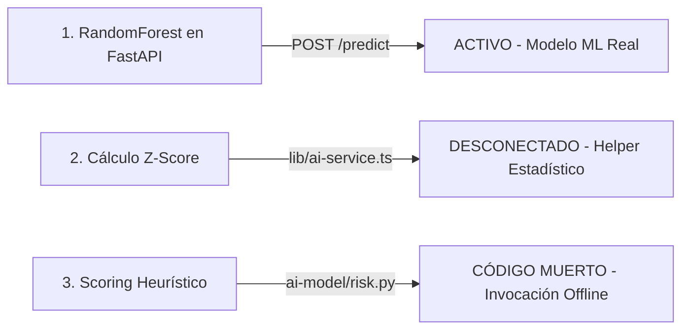

# MAPA E ÍNDICE DE NAVEGACIÓN DEL REPOSITORIO INTEGRA-MVP

> **Repositorio:** `gely25/INTEGRA-MVP`  
> **Rama:** `main`  
> **Propósito:** Guía de exploración directa del árbol de archivos. Permite ubicar exactamente qué archivo revisar o modificar para cualquier tarea dada sin necesidad de explorar el código a tientas.

---

## 1. Vista General de la Estructura de Carpetas

```
gely25/INTEGRA-MVP/
├── ai-model/                   # Microservicio de Inteligencia Artificial (Python + FastAPI + Scikit-Learn)
│   ├── api/                    # Servidor REST FastAPI y esquemas Pydantic
│   └── model/                  # Artefactos compilados serializados (.pkl)
├── app/                        # Aplicación Next.js 16 (App Router)
│   └── api/                    # Endpoints de la API Backend de Next.js
│       ├── ai-predict/         # Proxy hacia el microservicio Python de IA [ACTIVO]
│       ├── cases/              # Endpoint Prisma para casos [DESCONECTADO]
│       ├── events/             # Endpoint Prisma para eventos [DESCONECTADO]
│       └── simulate/           # Endpoint simulador local Z-Score [DESCONECTADO]
├── components/                 # Componentes de interfaz React
│   ├── blocks/                 # Modales, tarjetas de trazabilidad y paneles de auditoría
│   ├── ui/                     # Primitivas UI estilizadas (Select, Badges, Modales, Botones)
│   └── views/                  # Pantallas principales del Dashboard según cada rol RBAC
├── lib/                        # Estado global (Store), adaptadores de IA y estructuras de datos
├── prisma/                     # Esquema MySQL Prisma y script de sembrado (Seed)
└── [Archivos Raíz]             # Configuración del proyecto, dependencias y documentación
```

---

## 2. Tablas de Archivos por Carpeta

### 2.1. Rutas de API Backend (`app/api/`)

| Archivo (Ruta Exacta) | Qué es / Qué hace | Estado de Uso (Evidencia) |
| :--- | :--- | :---: |
| [`app/api/ai-predict/route.ts`](file:///c:/Users/Samira/Downloads/fixing-errors/app/api/ai-predict/route.ts) | Endpoint REST POST que recibe telemetría del cliente y consulta la predicción al microservicio FastAPI de Python. | **[ACTIVO]** Invocado desde `lib/store.tsx` en la función `fetchAiPrediction()`. |
| [`app/api/cases/route.ts`](file:///c:/Users/Samira/Downloads/fixing-errors/app/api/cases/route.ts) | Endpoints GET/POST para lectura y creación de casos usando Prisma ORM sobre MySQL. | **[DESCONECTADO]** No es invocado por ninguna vista del frontend. Falla al ejecutarse porque `lib/db.ts` exporta `prisma = {}`. |
| [`app/api/events/route.ts`](file:///c:/Users/Samira/Downloads/fixing-errors/app/api/events/route.ts) | Endpoint POST para inserción de eventos de custodia usando Prisma ORM sobre MySQL. | **[DESCONECTADO]** No es invocado desde el cliente; el store en memoria gestiona los eventos directamente. |
| [`app/api/simulate/route.ts`](file:///c:/Users/Samira/Downloads/fixing-errors/app/api/simulate/route.ts) | Endpoint POST que ejecuta el cálculo estadístico Z-Score sobre lecturas de temperatura. | **[DESCONECTADO]** No es invocado por ninguna vista activa del frontend. |

---

### 2.2. Páginas y Layout Principal (`app/`)

| Archivo (Ruta Exacta) | Qué es / Qué hace | Estado de Uso (Evidencia) |
| :--- | :--- | :---: |
| [`app/layout.tsx`](file:///c:/Users/Samira/Downloads/fixing-errors/app/layout.tsx) | Layout raíz de Next.js. Configura fuentes, proveedores de temas y el contenedor `StoreProvider`. | **[ACTIVO]** Envuelve toda la aplicación web. |
| [`app/page.tsx`](file:///c:/Users/Samira/Downloads/fixing-errors/app/page.tsx) | Punto de entrada principal (`Home`). Renderiza el componente `Dashboard`. | **[ACTIVO]** Carga la vista según el rol seleccionado. |
| [`app/globals.css`](file:///c:/Users/Samira/Downloads/fixing-errors/app/globals.css) | Estilos globales, variables de color CSS, animaciones y configuración de Tailwind v4. | **[ACTIVO]** Importado en `layout.tsx`. |

---

### 2.3. Vistas por Rol RBAC (`components/views/`)

| Archivo (Ruta Exacta) | Qué es / Qué hace | Estado de Uso (Evidencia) |
| :--- | :--- | :---: |
| [`components/views/coordinador-view.tsx`](file:///c:/Users/Samira/Downloads/fixing-errors/components/views/coordinador-view.tsx) | Dashboard para el Coordinador Nacional (INCUCAI). Permite autorizar contratos, simular escenarios y consultar la IA. | **[ACTIVO]** Renderizado cuando `roleActor === "incucai"`. |
| [`components/views/hospital-view.tsx`](file:///c:/Users/Samira/Downloads/fixing-errors/components/views/hospital-view.tsx) | Dashboard para el Hospital Receptor. Muestra la lista pre-quirúrgica, el reloj de isquemia y la confirmación de recepción. | **[ACTIVO]** Renderizado cuando `roleActor === "hospital"`. |
| [`components/views/auditor-view.tsx`](file:///c:/Users/Samira/Downloads/fixing-errors/components/views/auditor-view.tsx) | Dashboard de Auditoría 100% Solo Lectura. Muestra la cadena de bloques, expediente forense de caso cerrado e historial. | **[ACTIVO]** Renderizado cuando `roleActor === "auditor"`. |
| [`components/views/transportador-view.tsx`](file:///c:/Users/Samira/Downloads/fixing-errors/components/views/transportador-view.tsx) | Dashboard operacional para la ambulancia/chofer. Muestra métricas de telemetría y resolución interactiva de alertas de ruta. | **[ACTIVO]** Renderizado cuando `roleActor === "transportador"`. |
| [`components/views/proveedor-it-view.tsx`](file:///c:/Users/Samira/Downloads/fixing-errors/components/views/proveedor-it-view.tsx) | Dashboard para el técnico de IT (Tercerizado). Solicita acceso PAM y muestra la terminal grabada en vivo y salud de nodos. | **[ACTIVO]** Renderizado cuando `roleActor === "itprov"`. |
| [`components/views/iot-view.tsx`](file:///c:/Users/Samira/Downloads/fixing-errors/components/views/iot-view.tsx) | Panel de monitoreo de señales directas del contenedor inteligente IoT. | **[ACTIVO]** Renderizado en vista extendida de hardware. |

---

### 2.4. Componentes Bloques de Dominio (`components/blocks/`)

| Archivo (Ruta Exacta) | Qué es / Qué hace | Estado de Uso (Evidencia) |
| :--- | :--- | :---: |
| [`components/blocks/ai-anomaly-card.tsx`](file:///c:/Users/Samira/Downloads/fixing-errors/components/blocks/ai-anomaly-card.tsx) | Tarjeta visual que despliega el dictamen de IA (Riesgo Bajo/Medio/Alto y confianza) con opción de revisión. | **[ACTIVO]** Usado en `coordinador-view.tsx`, `hospital-view.tsx` y `auditor-view.tsx`. |
| [`components/blocks/manual-sign-modal.tsx`](file:///c:/Users/Samira/Downloads/fixing-errors/components/blocks/manual-sign-modal.tsx) | Modal interactivo para ingreso de código TOTP/MFA de 6 dígitos y emisión de Autorización Criptográfica X.509. | **[ACTIVO]** Invocado al firmar el contrato de asignación desde `coordinador-view.tsx` y `hospital-view.tsx`. |
| [`components/blocks/alert-resolution-modal.tsx`](file:///c:/Users/Samira/Downloads/fixing-errors/components/blocks/alert-resolution-modal.tsx) | Modal para que el transportador resuelva alertas de custodia seleccionando acciones operativas de mitigación. | **[ACTIVO]** Invocado al presionar "Resolver Alerta" en `transportador-view.tsx`. |
| [`components/blocks/forensic-panel.tsx`](file:///c:/Users/Samira/Downloads/fixing-errors/components/blocks/forensic-panel.tsx) | Expediente Forense de Caso Cerrado. Muestra el historial térmico, firmas X.509 y hash final de integridad. | **[ACTIVO]** Renderizado en `auditor-view.tsx` y `coordinador-view.tsx` al cerrar un caso. |
| [`components/blocks/traceability.tsx`](file:///c:/Users/Samira/Downloads/fixing-errors/components/blocks/traceability.tsx) | Componente del libro mayor (Ledger). Despliega el feed de eventos criptográficos encadenados con buscador y filtros. | **[ACTIVO]** Componente clave presente en los dashboards principales. |
| [`components/blocks/temperature-chart.tsx`](file:///c:/Users/Samira/Downloads/fixing-errors/components/blocks/temperature-chart.tsx) | Gráfico interactivo construido con `recharts` para series de temperatura interna vs. externa. | **[ACTIVO]** Renderizado en `custody-twin.tsx` y `forensic-panel.tsx`. |
| [`components/blocks/sim-clock-bar.tsx`](file:///c:/Users/Samira/Downloads/fixing-errors/components/blocks/sim-clock-bar.tsx) | Barra de control del reloj de simulación (Play, Pause, Reset, velocidad 60x-3600x, salto temporal y selector de escenarios). | **[ACTIVO]** Ubicada en la cabecera superior del dashboard para pruebas demostrativas. |
| [`components/blocks/alerts-panel.tsx`](file:///c:/Users/Samira/Downloads/fixing-errors/components/blocks/alerts-panel.tsx) | Panel de alertas activas y reconocidas con filtros por severidad. | **[ACTIVO]** Usado en la barra lateral e indicadores de eventos. |
| [`components/blocks/director-panel.tsx`](file:///c:/Users/Samira/Downloads/fixing-errors/components/blocks/director-panel.tsx) | Resumen ejecutivo del caso con métricas consolidadas e indicadores de contrato. | **[ACTIVO]** Usado en `coordinador-view.tsx`. |
| [`components/blocks/security.tsx`](file:///c:/Users/Samira/Downloads/fixing-errors/components/blocks/security.tsx) | Badge de estado de cifrado y verificación mTLS de la conexión. | **[ACTIVO]** Presente en la barra superior. |
| [`components/blocks/data-row.tsx`](file:///c:/Users/Samira/Downloads/fixing-errors/components/blocks/data-row.tsx) | Componente auxiliar para formatear filas clave/valor con tipografía monoespaciada. | **[ACTIVO]** Usado en modales y paneles informativos. |
| [`components/blocks/endorsement-error-modal.tsx`](file:///c:/Users/Samira/Downloads/fixing-errors/components/blocks/endorsement-error-modal.tsx) | Modal de error en caso de falla de consenso o descalce de firmas. | **[SECUNDARIO]** Disponible para simulación de errores de contrato. |

---

### 2.5. Componentes Reutilizables de Dominio (`components/`)

| Archivo (Ruta Exacta) | Qué es / Qué hace | Estado de Uso (Evidencia) |
| :--- | :--- | :---: |
| [`components/dashboard.tsx`](file:///c:/Users/Samira/Downloads/fixing-errors/components/dashboard.tsx) | Orquestador principal del dashboard. Renderiza la barra de simulación, menú de roles y delega a la vista activa (`views/*`). | **[ACTIVO]** Invocado directamente en `app/page.tsx`. |
| [`components/custody-twin.tsx`](file:///c:/Users/Samira/Downloads/fixing-errors/components/custody-twin.tsx) | Gemelo digital de custodia. Muestra el estado del contenedor, temperatura, mapa y barra de progreso. | **[ACTIVO]** Usado en vistas de coordinador, hospital y transportador. |
| [`components/ischemia-clock.tsx`](file:///c:/Users/Samira/Downloads/fixing-errors/components/ischemia-clock.tsx) | Reloj dinámico de cuenta regresiva para la ventana de isquemia tolerable del órgano. | **[ACTIVO]** Usado en la cabecera y paneles del hospital y coordinador. |
| [`components/stepper.tsx`](file:///c:/Users/Samira/Downloads/fixing-errors/components/stepper.tsx) | Línea de progreso por etapas del traslado (Preparado $\rightarrow$ Asignado $\rightarrow$ En Ruta $\rightarrow$ Arribado $\rightarrow$ Cerrado). | **[ACTIVO]** Usado en la cabecera principal del caso. |
| [`components/status-pill.tsx`](file:///c:/Users/Samira/Downloads/fixing-errors/components/status-pill.tsx) | Indicador tipo píldora de color para representar estados (Válido, Advertencia, Crítico, En Traslado). | **[ACTIVO]** Usado en múltiples tablas y tarjetas. |
| [`components/error-boundary.tsx`](file:///c:/Users/Samira/Downloads/fixing-errors/components/error-boundary.tsx) | Capturador de errores de renderizado en componentes React. | **[ACTIVO]** Envuelve secciones críticas del dashboard. |

---

### 2.6. Primitivas de UI (`components/ui/`)

| Archivo (Ruta Exacta) | Qué es / Qué hace | Estado de Uso (Evidencia) |
| :--- | :--- | :---: |
| [`components/ui/select.tsx`](file:///c:/Users/Samira/Downloads/fixing-errors/components/ui/select.tsx) | Componente `<Select>` avanzado construido con `@base-ui/react` para menús desplegables agrupados. | **[ACTIVO]** Usado en el filtro de tipos de eventos en `traceability.tsx`. |
| [`components/ui/button.tsx`](file:///c:/Users/Samira/Downloads/fixing-errors/components/ui/button.tsx) | Botones configurados con distintas variantes visuales Tailwind (`cva`). | **[ACTIVO]** Utilizado en toda la aplicación. |
| [`components/ui/badge.tsx`](file:///c:/Users/Samira/Downloads/fixing-errors/components/ui/badge.tsx) | Etiquetas de estado estilizadas (info, ok, warn, danger). | **[ACTIVO]** Utilizado en toda la aplicación. |
| [`components/ui/card.tsx`](file:///c:/Users/Samira/Downloads/fixing-errors/components/ui/card.tsx) | Contenedores de tarjetas con bordes, encabezados y pies de página. | **[ACTIVO]** Utilizado en toda la aplicación. |
| [`components/ui/tabs.tsx`](file:///c:/Users/Samira/Downloads/fixing-errors/components/ui/tabs.tsx) | Pestañas de navegación para alternar paneles. | **[ACTIVO]** Usado en `auditor-view.tsx` y `proveedor-it-view.tsx`. |
| [`components/ui/progress.tsx`](file:///c:/Users/Samira/Downloads/fixing-errors/components/ui/progress.tsx) | Barra de progreso visual para porcentajes (batería, avance de ruta). | **[ACTIVO]** Usado en `custody-twin.tsx` e `ischemia-clock.tsx`. |
| [`components/ui/scroll-area.tsx`](file:///c:/Users/Samira/Downloads/fixing-errors/components/ui/scroll-area.tsx) | Área con barra de desplazamiento personalizada. | **[ACTIVO]** Usado en la terminal PAM y feeds de trazabilidad. |
| [`components/ui/dropdown-menu.tsx`](file:///c:/Users/Samira/Downloads/fixing-errors/components/ui/dropdown-menu.tsx) | Menús desplegables contextuales. | **[ACTIVO]** Usado en selectores de tema e identidad. |
| [`components/ui/sheet.tsx`](file:///c:/Users/Samira/Downloads/fixing-errors/components/ui/sheet.tsx) | Paneles laterales deslizantes (*Drawers*). | **[ACTIVO]** Usado para alertas colapsables. |
| [`components/ui/sonner.tsx`](file:///c:/Users/Samira/Downloads/fixing-errors/components/ui/sonner.tsx) | Componente tostador de notificaciones. | **[ACTIVO]** Importado en `layout.tsx`. |
| [`components/ui/checkbox.tsx`](file:///c:/Users/Samira/Downloads/fixing-errors/components/ui/checkbox.tsx) | Casilla de selección estilizada. | **[ACTIVO]** Usado en listas de verificación médica. |
| [`components/ui/label.tsx`](file:///c:/Users/Samira/Downloads/fixing-errors/components/ui/label.tsx) | Etiqueta de texto accesible para formularios. | **[ACTIVO]** Usado en modales de firma. |
| [`components/ui/separator.tsx`](file:///c:/Users/Samira/Downloads/fixing-errors/components/ui/separator.tsx) | Línea divisora visual horizontal/vertical. | **[ACTIVO]** Usado en menús y tarjetas. |
| [`components/ui/chart.tsx`](file:///c:/Users/Samira/Downloads/fixing-errors/components/ui/chart.tsx) | Contenedor de leyendas y tooltips para `recharts`. | **[ACTIVO]** Usado en `temperature-chart.tsx`. |

---

### 2.7. Lógica Central, Store y Adaptadores (`lib/`)

| Archivo (Ruta Exacta) | Qué es / Qué hace | Estado de Uso (Evidencia) |
| :--- | :--- | :---: |
| [`lib/store.tsx`](file:///c:/Users/Samira/Downloads/fixing-errors/lib/store.tsx) | **El núcleo del sistema en memoria.** Maneja el reloj de simulación, eventos encadenados con SHA-256 (`genHash`), alertas, llamadas al modelo de IA y mutaciones de estado React. | **[ACTIVO]** Proveedor de estado global consumido por todos los componentes vía `useStore()`. |
| [`lib/case-data.ts`](file:///c:/Users/Samira/Downloads/fixing-errors/lib/case-data.ts) | Definiciones de tipos TypeScript, constantes iniciales (`INITIAL_CASE`, `INITIAL_EVENTS`) y la secuencia de eventos de la simulación (`TIMELINE_EVENTS`). | **[ACTIVO]** Importado directamente en `lib/store.tsx`. |
| [`lib/ai-service.ts`](file:///c:/Users/Samira/Downloads/fixing-errors/lib/ai-service.ts) | Adaptador cliente que conecta con la API de IA. Contiene `predictRisk()` (llamada a FastAPI) y `generateSimulationData()` (Z-Score local). | **[ACTIVO]** `predictRisk()` es llamado desde `app/api/ai-predict/route.ts`. |
| [`lib/db.ts`](file:///c:/Users/Samira/Downloads/fixing-errors/lib/db.ts) | Archivo de inicialización del cliente Prisma ORM. | **[DESCONECTADO]** Contiene `export const prisma: any = {}` y un comentario aclarando que la persistencia MySQL está fuera del MVP en memoria. |
| [`lib/format.ts`](file:///c:/Users/Samira/Downloads/fixing-errors/lib/format.ts) | Funciones utilitarias para formateo de fechas, números, duraciones y hashes truncados. | **[ACTIVO]** Usado en componentes de interfaz. |
| [`lib/nav.ts`](file:///c:/Users/Samira/Downloads/fixing-errors/lib/nav.ts) | Definición de elementos de navegación y menús por rol. | **[ACTIVO]** Usado en el encabezado principal. |
| [`lib/utils.ts`](file:///c:/Users/Samira/Downloads/fixing-errors/lib/utils.ts) | Utilidad `cn()` para fusionar clases Tailwind CSS (`clsx` + `tailwind-merge`). | **[ACTIVO]** Usado en todas las primitivas UI. |

---

### 2.8. Base de Datos y Prisma (`prisma/`)

| Archivo (Ruta Exacta) | Qué es / Qué hace | Estado de Uso (Evidencia) |
| :--- | :--- | :---: |
| [`prisma/schema.prisma`](file:///c:/Users/Samira/Downloads/fixing-errors/prisma/schema.prisma) | Esquema relacional de MySQL con modelos `Case`, `Event`, `Telemetry` y `Alert`. | **[PREPARADO / DESCONECTADO]** Define la estructura de base de datos para la siguiente fase con persistencia real. |
| [`prisma/seed.ts`](file:///c:/Users/Samira/Downloads/fixing-errors/prisma/seed.ts) | Script de inicialización de datos de prueba en la base de datos MySQL. | **[DESCONECTADO]** Script auxiliar ejecutable manualmente (`npx prisma db seed`). |
| [`prisma.config.ts`](file:///c:/Users/Samira/Downloads/fixing-errors/prisma.config.ts) | Archivo de configuración global del CLI de Prisma v7. | **[CONFIGURACIÓN]** Utilizado por el CLI de Prisma. |

---

### 2.9. Microservicio de IA en Python (`ai-model/`)

| Archivo (Ruta Exacta) | Qué es / Qué hace | Estado de Uso (Evidencia) |
| :--- | :--- | :---: |
| [`ai-model/api/main.py`](file:///c:/Users/Samira/Downloads/fixing-errors/ai-model/api/main.py) | Punto de entrada de la API FastAPI. Expone el endpoint `POST /predict`. | **[ACTIVO (Servicio Python)]** Servidor que atiende las peticiones de inferencia. |
| [`ai-model/predict.py`](file:///c:/Users/Samira/Downloads/fixing-errors/ai-model/predict.py) | Carga los archivos `.pkl` y ejecuta la función `predecir(datos)` con `RandomForestClassifier`. | **[ACTIVO (Servicio Python)]** Invocado por `api/main.py`. |
| [`ai-model/train.py`](file:///c:/Users/Samira/Downloads/fixing-errors/ai-model/train.py) | Script de entrenamiento del modelo `RandomForestClassifier` (`n_estimators=200`, `max_depth=12`). | **[HERRAMIENTA DE DESARROLLO]** Ejecutado en la fase de entrenamiento para generar los `.pkl`. |
| [`ai-model/simulator.py`](file:///c:/Users/Samira/Downloads/fixing-errors/ai-model/simulator.py) | Generador de 100 casos sintéticos de telemetría para crear `data/telemetria_entrenamiento.csv`. | **[HERRAMIENTA DE DESARROLLO]** Utilizado para generar el dataset de entrenamiento. |
| [`ai-model/risk.py`](file:///c:/Users/Samira/Downloads/fixing-errors/ai-model/risk.py) | Función heurística de scoring por puntos manuales (`calcular_score`). | **[CÓDIGO MUERTO]** No es importado ni invocado por `api/main.py` ni por `predict.py`. |
| [`ai-model/config.py`](file:///c:/Users/Samira/Downloads/fixing-errors/ai-model/config.py) | Constantes y rangos de simulación para órganos, transportes e incidentes. | **[ACTIVO]** Usado por `simulator.py` y `risk.py`. |
| [`ai-model/utils.py`](file:///c:/Users/Samira/Downloads/fixing-errors/ai-model/utils.py) | Funciones de carga con `joblib` y formateo de datos en DataFrames Pandas. | **[ACTIVO]** Invocado por `predict.py`. |
| [`ai-model/api/schemas.py`](file:///c:/Users/Samira/Downloads/fixing-errors/ai-model/api/schemas.py) | Esquemas Pydantic (`PredictionRequest`, `PredictionResponse`) para validación JSON. | **[ACTIVO]** Invocado por `api/main.py`. |
| [`ai-model/requirements.txt`](file:///c:/Users/Samira/Downloads/fixing-errors/ai-model/requirements.txt) | Lista de dependencias del entorno Python (`fastapi`, `uvicorn`, `scikit-learn`, `pandas`). | **[CONFIGURACIÓN]** Utilizado para instalar el entorno virtual Python. |
| `ai-model/model/integra_model.pkl` | Binario del modelo Random Forest entrenado. | **[ACTIVO]** Cargado en memoria por `utils.py`. |
| `ai-model/model/label_encoders.pkl` | Binario de los codificadores de etiquetas texto-número. | **[ACTIVO]** Cargado en memoria por `utils.py`. |
| `ai-model/model/feature_columns.pkl` | Binario con el orden estricto de las 16 columnas de entrada. | **[ACTIVO]** Cargado en memoria por `utils.py`. |

---

## 3. Tabla Comparativa de Módulos de IA y Anomalías

El proyecto incluye 3 implementaciones distintas relacionadas con análisis de datos o inteligencia artificial. La siguiente tabla aclara la ubicación y el estado de ejecución real de cada una:



| Módulo / Algoritmo | Ubicación en Código | Cómo funciona | Estado en el Flujo Activo |
| :--- | :--- | :--- | :---: |
| **1. Modelo ML Real (Random Forest)** | [`ai-model/api/main.py`](file:///c:/Users/Samira/Downloads/fixing-errors/ai-model/api/main.py)<br>[`ai-model/predict.py`](file:///c:/Users/Samira/Downloads/fixing-errors/ai-model/predict.py)<br>[`app/api/ai-predict/route.ts`](file:///c:/Users/Samira/Downloads/fixing-errors/app/api/ai-predict/route.ts) | Evalúa 16 variables de telemetría mediante 200 árboles de decisión entrenados en scikit-learn. Retorna nivel de riesgo (Low/Medium/High) y % de confianza. | **[ACTIVO]**<br>Se ejecuta al presionar "Consultar IA" en la interfaz o cuando el store consulta el endpoint `/api/ai-predict`. |
| **2. Detección Estadísticas Z-Score** | [`lib/ai-service.ts`](file:///c:/Users/Samira/Downloads/fixing-errors/lib/ai-service.ts#L35-L72)<br>[`app/api/simulate/route.ts`](file:///c:/Users/Samira/Downloads/fixing-errors/app/api/simulate/route.ts) | Calcula la media y desviación estándar de una ventana de 5 lecturas de temperatura. Dispara anomalía si $Z > 3.0$ o temp $\ge 7.5^\circ\text{C}$. | **[DESCONECTADO]**<br>La función existe en `lib/ai-service.ts` como simulación local auxiliar, pero el bucle principal de la aplicación (`lib/store.tsx`) no la invoca. |
| **3. Scoring Heurístico Ponderado** | [`ai-model/risk.py`](file:///c:/Users/Samira/Downloads/fixing-errors/ai-model/risk.py) | Asigna puntos de penalización manuales mediante condicionales `if/else` (ej: $+40$ pts si la temperatura superaba $8^\circ\text{C}$). | **[CÓDIGO MUERTO]**<br>Script de desarrollo offline. La API FastAPI de producción (`main.py`) no importa ni ejecuta las funciones de `risk.py`. |

---

## 4. Preguntas Frecuentes de Navegación (¿Dónde cambio X?)

### Q1: ¿Dónde modifico la velocidad de la simulación o los eventos que ocurren en la línea de tiempo?
* **Respuesta:** En [`lib/case-data.ts`](file:///c:/Users/Samira/Downloads/fixing-errors/lib/case-data.ts). Busca la constante `TIMELINE_EVENTS`. Para cambiar la lógica del reloj o los intervalos del temporizador, revisa [`lib/store.tsx`](file:///c:/Users/Samira/Downloads/fixing-errors/lib/store.tsx) en el hook `useEffect` de la simulación.

---

### Q2: ¿Dónde cambio los colores o los textos del modal de Firma Digital / Autorización Criptográfica?
* **Respuesta:** En [`components/blocks/manual-sign-modal.tsx`](file:///c:/Users/Samira/Downloads/fixing-errors/components/blocks/manual-sign-modal.tsx). Allí se gestionan los campos del formulario, la validación del PIN TOTP de 6 dígitos y los mensajes de confirmación de firma X.509.

---

### Q3: ¿Dónde ajusto las reglas de acceso o qué botones puede ver cada rol de usuario?
* **Respuesta:** Cada rol tiene su propia vista en la carpeta [`components/views/`](file:///c:/Users/Samira/Downloads/fixing-errors/components/views/).
  * Para INCUCAI: [`coordinador-view.tsx`](file:///c:/Users/Samira/Downloads/fixing-errors/components/views/coordinador-view.tsx)
  * Para el Hospital: [`hospital-view.tsx`](file:///c:/Users/Samira/Downloads/fixing-errors/components/views/hospital-view.tsx)
  * Para el Auditor (Solo Lectura): [`auditor-view.tsx`](file:///c:/Users/Samira/Downloads/fixing-errors/components/views/auditor-view.tsx)
  * Para el Transportador Operativo: [`transportador-view.tsx`](file:///c:/Users/Samira/Downloads/fixing-errors/components/views/transportador-view.tsx)
  * Para el Técnico IT (PAM): [`proveedor-it-view.tsx`](file:///c:/Users/Samira/Downloads/fixing-errors/components/views/proveedor-it-view.tsx)

---

### Q4: ¿Dónde se calcula el hash criptográfico encadenado SHA-256 de los eventos?
* **Respuesta:** En [`lib/store.tsx`](file:///c:/Users/Samira/Downloads/fixing-errors/lib/store.tsx), dentro de la función `genHash(prevHash, payload)` (líneas 40-50) y la función `addEventRaw` (líneas 183-215).

---

### Q5: ¿Dónde cambio los hiperparámetros o las variables del modelo de Inteligencia Artificial?
* **Respuesta:** 
  * Para hiperparámetros de entrenamiento (`n_estimators`, `max_depth`): [`ai-model/train.py`](file:///c:/Users/Samira/Downloads/fixing-errors/ai-model/train.py#L169-L181).
  * Para el mapeo de variables desde el frontend hacia la API de IA: [`lib/store.tsx`](file:///c:/Users/Samira/Downloads/fixing-errors/lib/store.tsx#L488-L557) en `fetchAiPrediction()` y [`app/api/ai-predict/route.ts`](file:///c:/Users/Samira/Downloads/fixing-errors/app/api/ai-predict/route.ts).

---

### Q6: ¿Dónde conecto una base de datos MySQL real en lugar del estado en memoria?
* **Respuesta:** En [`lib/db.ts`](file:///c:/Users/Samira/Downloads/fixing-errors/lib/db.ts). Debes reemplazar `export const prisma: any = {}` por una instancia real de Prisma (`new PrismaClient()`) y conectar las llamadas `fetch()` en [`lib/store.tsx`](file:///c:/Users/Samira/Downloads/fixing-errors/lib/store.tsx) hacia los endpoints de API [`app/api/cases/route.ts`](file:///c:/Users/Samira/Downloads/fixing-errors/app/api/cases/route.ts) y [`app/api/events/route.ts`](file:///c:/Users/Samira/Downloads/fixing-errors/app/api/events/route.ts).

---

### Q7: ¿Dónde agrego un nuevo tipo de filtro en el feed de trazabilidad o eventos?
* **Respuesta:** En [`components/blocks/traceability.tsx`](file:///c:/Users/Samira/Downloads/fixing-errors/components/blocks/traceability.tsx) y en el componente de menú desplegable [`components/ui/select.tsx`](file:///c:/Users/Samira/Downloads/fixing-errors/components/ui/select.tsx).

---

### Q8: ¿Dónde se encuentra la definición del modelo de datos de Prisma?
* **Respuesta:** En [`prisma/schema.prisma`](file:///c:/Users/Samira/Downloads/fixing-errors/prisma/schema.prisma). Contiene las entidades `Case`, `Event`, `Telemetry` y `Alert`.
